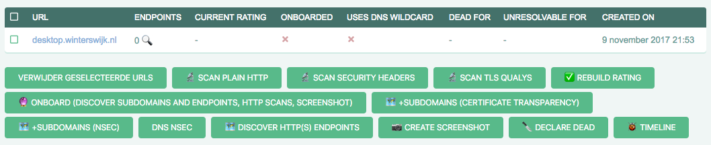

# Administration

This is a short manual to help with administration of information in the admin interface.

## Getting started
The admin interface is located on https://admin.faalkaart.nl/admin/, to visit this you
need a failmap certificate, which you can obtain from the development team. They can also
help you obtaining or resetting a (your) password.

It is recommended to have a few windows open while administrating:

- Admin interface: https://admin.faalkaart.nl/admin/
- Issues: https://gitlab.com/failmap/tickets/issues/
- Chat: https://gitter.im/internet-cleanup-foundation/

## Overview
The Failmap Admin inteface is a classic "CRUD" (Create Read Update Delete) interface directly
on top of the django ORM, close to the database. As such the presentation contains a lot of fields.

## When encountering bugs / need features
Please create an issue here: https://gitlab.com/failmap/failmap/issues

## Admin Actions
Admin actions make it easier to run scanners. They are visible at the bottom of lists.




### Scan Plain HTTP
Scans for lack of HTTPS. If there is only HTTP and no HTTPS on the standard ports, this will show a high risk issues.


### Scan Security Headers
Scans for HTTP server headers. Results in medium and low risk issues.

### Scan TLS Qualys
Runs a TLS scan


### Rebuild Rating


### Onboard


### Subdomains (Certificate Transparency)

### Subdomains (NSEC)


### Discover HTTP(S) Endpoints


### Create Screenshot
Doesn't work.

### Declare dead


## (advanced) debugging issues
Grafana can be useful to see that "scan tasks" are running when issued.

- Grafana: https://grafana.faalkaart.nl/dashboard/db/tasks?orgId=1&from=now-5m&to=now&refresh=10s

Using Sentry, it's possible to see if there where crashes in any of the scanners:

- Sentry: https://sentry.io/internet-cleanup-foundation/faalkaart/

Server access (server managers only):

```bash
ssh -A user@faalserver.faalkaart.nl
sudo su -
journalctl -u docker-failmap-<tab><tab>

or

journalctl -f -u docker-failmap*
failmap-logtail
```

This will allow you to see the output of running services.

If all else fails, run a failmap locally and view it's output.

