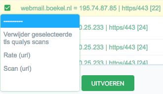

# Available scanners

## Supported scans

| Scan                | Port(s)     | IPv Support | Protocols | Rate limit | Rotation               |
| :------------------ | :---------- | :---------- | :-------- | :--------- | :---------             |
| DNS                 | A/AAAA      | -           | DNS       | No         | Not yet automated      |
| Endpoint discovery  | Defaults    | 4           | http(s)   | No         | Per 3 days             |
| TLS (qualys)        | 443         | 4, 6        | TLS       | 1/minute   | Per 3 days             |
| Headers             | Any http(s) | 4           | http(s)   | No         | Daily                  |
| Screenshots         | Any http(s) | 4           | http(s)   | 1 thread   | Not yet automated      |
| Plain HTTPS         | Any http(s) | 4           | http(s)   | No         | Daily                  |
| DNSSEC              | -           | -           | DNS       | No         | Daily                  |


### DNS
The DNS scanner tries to find hostnames using various strategies:
- Brute force on a subdomain list (existing subdomains only)
- Looking at NSEC1 hashes
- Looking at Certificate transparency

Less popular, not fully automated, but also implemented:
- brute forcing dictionaries
- looking in search engines

### Endpoint Discovery
Tries to find HTTP(s) endpoints on standard HTTP(s) ports. A normal website currently has about four endpoints:
- IPv6 port 80, redirect to port 443
- IPv6 port 443, actual website
- IPv4 port 80, redirect to port 443
- IPv4 port 443, actual website

We store them separately as implementation mistakes might occur on any of these endpoints.

### TLS (qualys)
Runs a scan on ssllabs from Qualys and incorporates the result.

### Headers
Contacts an endpoint and verifies HTTP headers for various security settings. (HSTS etc)

### Screenshots
Uses chrome headless to contact a website and make a screenshot for it. This screenshow it displayed next to the results
in the report.

### Plain HTTPS
Checks if a website that only has a site on port 80 also has a secure equivalent. No port-80-only sites should exist.

### DNSSEC
Checks if the toplevel domain implements DNSSEC correctly. Uses the dotSE scanner which is included.

## Scheduling
Scanners are scheduled as periodic tasks in Django admin. They are disabled by default and might not all be included in
the source distribution. Creating a scan is actually easy. For example:

- General/Name: discover-endpoints
- General/Enabled: Yes
- General/Task: discover-endpoints
- Schedule/Interval: every 3 days
- Arguments/Arguments: ["failmap.scanners.scanner_http"]
- Execution Options/Queue: storage

## Manual scans

### Command line
The Scan command can help you:

```bash
failmap scan 'scanner name'
```

The message returned will tell you what scanners you can run manually. All scanners have the same set of options.

### Admin interface
It's possible to run manual scans, at the bottom of a selection.
Note that this is beta functionality and please don't do this too much as the "priority" scanning queue is not functioning.
You can try out a scan or two, some take a lot of time.


