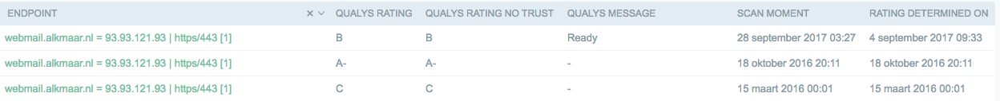

# Available scanners

## Supported scans

| Scan                | Port(s)     | IPv Support | Protocols | Rate limit
| :------------------ | :---------- | :---------- | :-------- | :-----
| DNS                 | A/AAAA      | -           | DNS       | No
| HTTP(s) discovery   | Defaults    | 4           | http(s)   | No
| TLS (qualys)        | 443         | 4, 6        | TLS       | 1/minute
| Headers             | Any http(s) | 4           | http(s)   | No
| Screenshots         | Any http(s) | 4           | http(s)   | 1 thread
| Plain HTTP          | Any http(s) | 4           | http(s)   | No

## Data Model
* Organization n<-->n Url,
* Url 1<-->n Endpoint
* Endpoint 1<-->n scans (various types)

todo: datamodel

## Scheduling

Scanners in Failmap run automatically. They are queued and then run in different strategies.

## Manual scans
It's possible to run manual scans, at the bottom of a selection. Note that this is beta functionality and please don't do this too much as the "priority" scanning queue is not functioning. You can try out a scan or two, some take a lot of time.

Data reduction / Stacking pattern
---------------------------------
Only changes in the result of a scan creates a new scan. This is to save on the amount of records in the database. Consider the following:

As seen in the below image, a rating was determined on 4 september, and all re-scans until the 28th of september resulted in the same rating.
What you can also see is that over time ratings changed.

## Ratings

Colors that are shown on the map are OrganizationRatings. These are built out of Url ratings, which are built on all kinds of scans that where performed at a certain time.

Creating a rating of an organization is a bit complex, as there is a time factor for all scans and all url ratings.

Currently ratings are automatically rebuilt every night.

