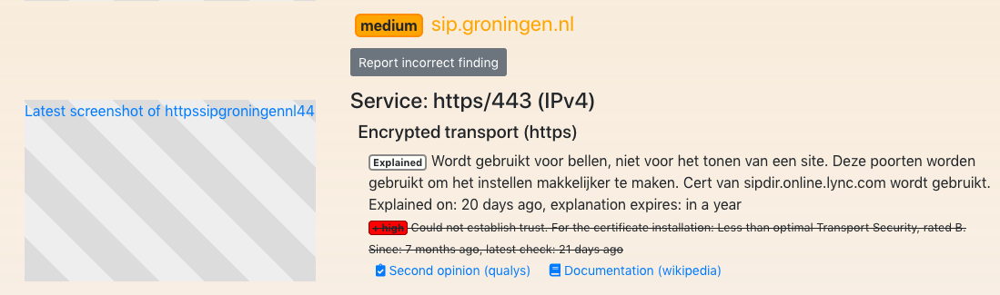
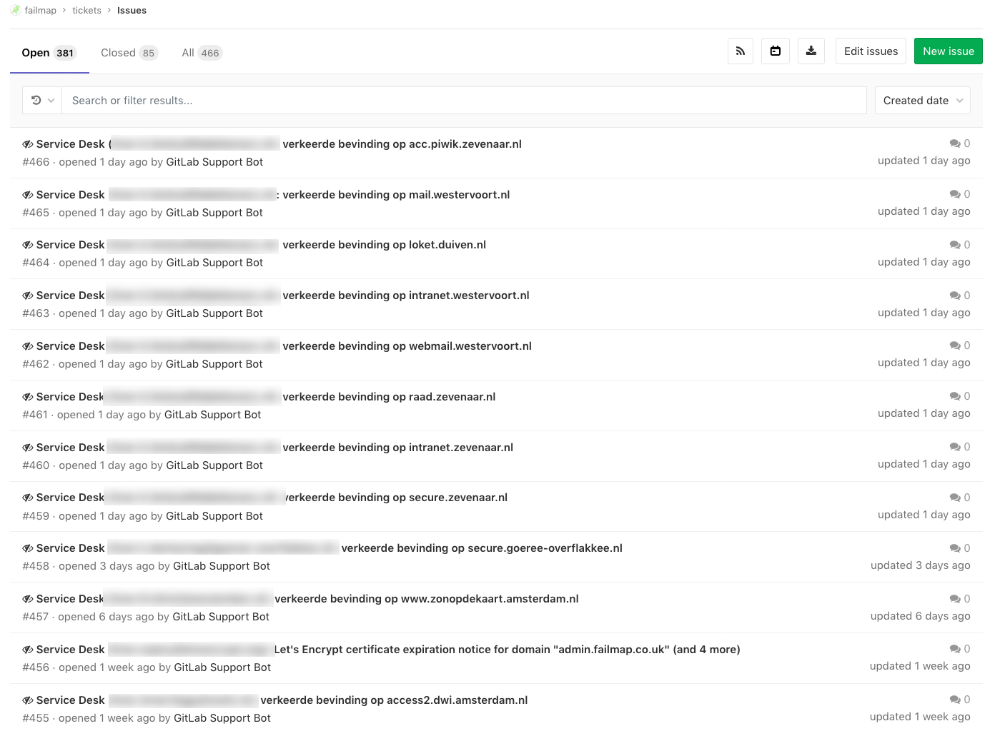
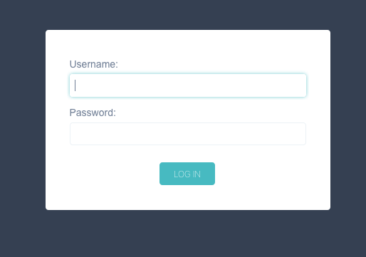
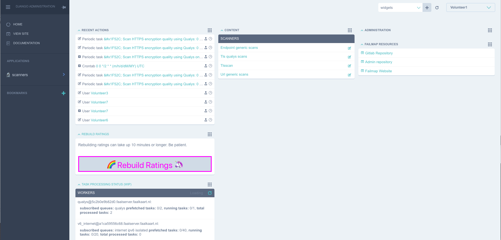
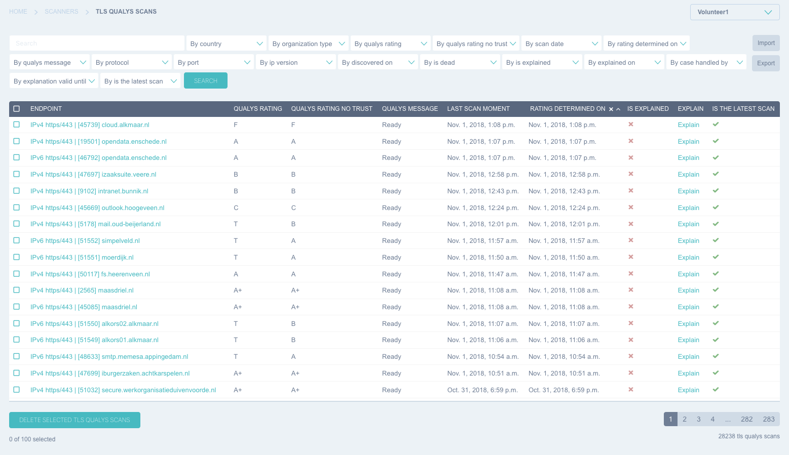
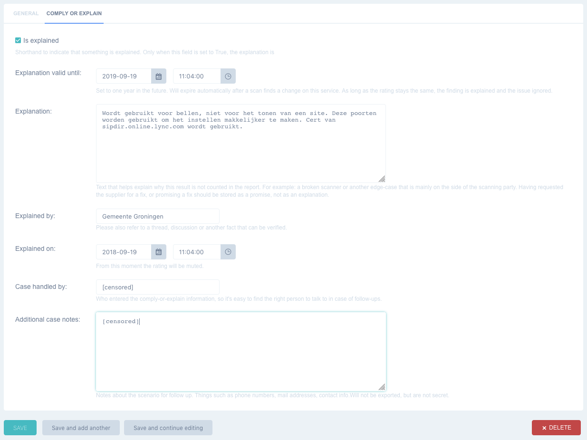

# Comply or explain
Comply or explain allows owners of services to publicly explain why a certain rating should be different / ignored or invalidated.
This allows them to handle edge cases which impede them from ever becoming compliant to common basic security practices.

An explanation can be given for each scan that is done on an organization. Each explanation allows to enter some reasoning and
has an expiration date. An explanation will thus expire after some time and should be set to a reasonable amount of time.
(typically a year).

All explanations are published on the website and can also be downloaded for analysis.

Some common reasons why an explanation is used:

- A scanner gave a wrong rating, or the rating can be explained without compromising security.
- A scanner could not connect to the scanned service because of incorrect implementation in Web Security Map.
- A scanner was not behaving according to modern security practices or RFC's.
- The result contains a glitch, for example: two conflicting results are shown instead of one.

## Explanation and correctness
Comply or explain can be extremely powerful. With this power also comes responsibility. There are several tools that make sure
correct information is displayed. Some of these are:

### Transparency
An explanation can applied to any issue, even high risk issues. Explaining something does not make the finding go away. Instead
the finding is shown accompanied by the explanation. This is done because a third-party scan will still see the service
as insecure: the third party can now correlate their can result with your explanation.

Here is an example of a high-risk issue that has been explained. Note that the high-risk has a strike through but is still present.

### Preventing known common incorrect explanations
Not everyone is a tech or security wizard. This leads to some explanations being given that do not make sense from a security and
usually the operational perspective. The following are two examples of explanations which will be ignored:

Invalid explanation 1: This is a public service, thus the data does not need to be encrypted.

This is invalid because the organization should not determine the privacy of the client. The client will determine if
they want to shield their data-transfer from third parties or not. Additionally encryption also results in data integrity
which is also important when serving public information.

Invalid explanation 2: We don't offer this kind of security as a matter of policy.

Not implementing the most basic security norms because of a differing policy is possible. But the policy has to be explained
publicly and has to align with the norms set by the known compliance drivers.
Usually a vague explanation like this will be met with scrutiny: why is your policy more important than common
security practices? What makes you decide security in this case is not as relevant?

### Explanation agreement and public accountability
Every volunteer handling explanations agrees to be excellent: helpful, professional and honest.

## Example Explanation: SIP Telephone services
Below screenshot shows an organization explaining a high risk issue: their domain runs SIP (phone services) on ports 80 and 443.
The vendor of these services has explained they will only use these ports for telephone data between their clients using their
own (public and trusted) certificate.

The certificate used by the third party is technically correct, but does not use the name of the municipality. Therefore
there is no explicit trust. The clients however do check the certificate and there is no website configured at this address.

Usually ports 80 and 443 are used for the HTTP protocol: websites and webservices. In this case these ports are used
because they are easier to configure on the firewall.

Our scanner sees that the incorrectly named certificate is used on a standard website port. Therefore it marks the website
as not trusted. Yet because the url is only used by phones, and there is no website configured, the organization actually
trusts this certificate setup. The finding has been explained.

If you do not agree with the explanation or the type of explanation, it's possible to open an issue at our gitlab page.
This page is located at: https://gitlab.com/Web Security Map/tickets/issues

## Becoming an comply or explain volunteer

It's possible to become a volunteer, which can help enter "comply or explain" requests. You will be granted access to the
private issue feed where you can view explain-requests. You'll also be able to manipulate explain information for scans.

This gives a unique position to help your and other organizations to handle edge cases.

As a volunteer you will be given:

- Access to the issue list, with confidential issues: https://gitlab.com/Web Security Map/tickets/issues
- Access to the admin interface using a personal client-certificate.
- A personal account on the admin interface.
- Access to the scans in Web Security Map, with the possibility to alter explanations.
- Access to the chat group: https://gitter.im/internet-cleanup-foundation/comply_or_explain?source=orgpage

## Explanation code of conduct

Be excellent to each other.

When handling explain-requests, or any issue in Web Security Map, you're working with partially confidential information. For example:
who is doing the explanation is secret because of privacy reasons (but not the organization explaining it).

When handling explain request we expect a professional attitude which is constructive.

## How to view the latest issues
We don't have a helpdesk system set up yet, and instead are using a gitlab repository to receive issues.

The address for this site is: https://gitlab.com/Web Security Map/tickets/issues

This list will look empty when you're not logged in. But if you are logged in, and with the right permissions, you'll
see a list like this:

To access this list of issues, you need a gitlab account. You can create one here: https://gitlab.com/users/sign_in

After creating an account, share your account name with a volunteer that's already in gitlab. A list is displayed here: https://gitlab.com/Web Security Map/tickets/project_members

You'll be grated access and then will be able to see the content of the service desk and able to reply: https://gitlab.com/Web Security Map/tickets/issues/service_desk

## How to explain a scan

### Install the client-side certificate in your browser
To reach the admin interface, you need to use a client-side certificate. This certificate will be handed out when you
sign up as a volunteer.

Here are some guides that explain how to install the certificate:

- https://knowledge.digicert.com/solution/SO5437.html
- https://www.binarytides.com/client-side-ssl-certificates-firefox-chrome/

Once installed it's possible to visit the Web Security Map admin interface.

### Log into the admin interface
After certificate installation you can visit the Web Security Map admin interface. This interface is usally listed at the following domain:

https://admin.Web Security Map-website/admin/

For the Netherlands this is: https://basisbeveiliging.nl/admin/

Here you'll be greeted with a login screen. Enter the username and password you've received after signing up.

### The admin interface
After succesfully logging in, you're looking at the admin interface. The interface shows a number of columns that show
the latest changes, static links and the contents of scanners. On the menu on the side you'll also see a link to scanners.

There are three types of scans in the admin interface. These are detailed in the next chapter.

### Types of scans
The admin interface lists four types of scans:

#### Endpoint Generic Scans
These are actually a variety of different scans stored in the same database structure. The scans saved here are:
HTTP header scans, ftp and plain_https scans.

#### TLS Qualys scans
Scans on the HTTPS quality, performed by Qualys.

#### TLS Scans
This list is empty, and is reserved for future use.

#### Url Generic scans
Just like Endpoint Generic scans, these are multiple scans stored in the same structure. Currently these are only
DNSSEC scans.

### Finding the scan you're looking for
There is a surprising amount of filters and search options for each scan. It should be pretty easy to find the scan
you're looking for.

As you can see in the image below, you can filter on: country, organization type, qualys rating, date, message, protocol,
port, ip version, when it was discovered, if the url is still alive, if there already is an explanation, who gave the
explanation and so on.

If you know the address, you can just enter the address in the search bar and it will find it for you:

For Example: 

If you're looking for everything related to the url "veere.nl", you can enter "veere.nl" in the search box. Or 
use the following urls to directly navigate to the relevant scans:

https://basisbeveiliging.nl/admin/scanners/tlsqualysscan/?q=veere.nl
https://basisbeveiliging.nl/admin/scanners/urlgenericscan/?q=veere.nl
https://basisbeveiliging.nl/admin/scanners/endpointgenericscan/?q=veere.nl

### Historical data
Scans are saved over time: this means you can also see scans from last year. To know that you're working in the latest
scan, check the "is the latest scan" value. This will show up in the most accurate reports and the map. Otherwise you'll
editing results of the past, which are only visible in reports of the past.

### Alter comply or explain information
Clicking the "explain" link, or editing the scan, you'll be presented with the below screen. This allows you to enter information.

Please fill in all the fields, including since when the explanation is valid and the expiry date. Expiry is usally a single
year.

Note the descriptions for each field below the field for further detailed instructions.

Afterwards click save, and you're done. Repeat the process for any scan you want to alter.

### After explaining, just wait
Every night new reports and map data is calculated. This means your explanations will be processed later in the night and
will be visible for the rest of the world tomorrow.

## Frequently asked questions

### Why is my explanation gone?
Explanations will be tied to a specific scan. When the scan result changes, you need to explain again. So if the result
changes, better make sure that no explanation is needed anymore. We usually see this happen with TLS scans, as the
security of TLS slowly degrades over time.

