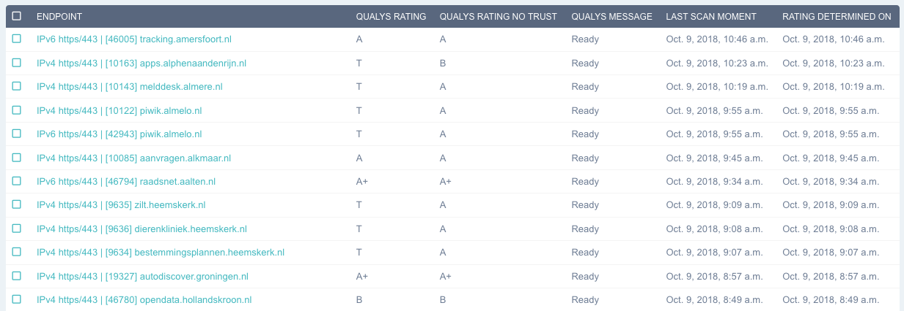

# Comply or explain
Comply or explain allows owners of services to publicly explain why a certain rating should be different / ignored or invalidated.
This allows them to handle edge cases which impede them from ever becoming compliant to common basic security practices.

An explanation can be given for each scan that is done on an organization. Each explanation allows to enter some reasoning and
has an expiration date. An explanation will thus expire after some time and should be set to a reasonable amount of time.
(typically a year).

All explanations are published on the website and can also be downloaded for (later) import in other systems.

Some common reasons why an explanation is used:

- A scanner gave a wrong rating, or the rating can be explained without compromising security.
- A scanner could not connect to the scanned service because of incorrect implementation in failmap.
- A scanner was not behaving according to modern security practices or RFC's.
- The result contains a glitch, for example: two conflicting results are shown instead of one.

## Explanation and abuse
Comply or explain can be extremely powerful. With this power also comes responsibility. There are several tools that prevent
abuse. Some of them are:

### Transparency
An explanation can applied to any issue, even high risk issues. Explaining something does not make the finding go away. Instead
the finding is shown accompanied by the explanation. This is done because a third-party scan will still see your service
as insecure: the third party can now correlate their can result with your explanation.

Here is an example of a high-risk issue that has been explained. Note that the high-risk has a strike through but is still present.

### Known common incorrect explanations
Not everyone is a tech or security wizard. This leads to some explanations being given that do not make sense from a security and
usually the operational perspective. The following are two examples of explanations which will be ignored:

Invalid explanation 1: This is a public service, thus the data does not need to be encrypted.

This is invalid because the organization should not determine the privacy of the client. The client will determine if
they want to shield their data-transfer from third parties or not. Additionally encryption also results in data integrity
which is also important when serving public information.

Invalid explanation 2: We don't offer this kind of security as a matter of policy.

Not implementing the most basic security norms because of a differing policy is possible. But the policy has to be explained publicly.
Usually a vague explanation like this will be met with scrutiny: why is your policy more important than the universally advised
security practices? What makes you decide security in this case is not as relevant?

### Explanation agreement and public accountability
Every volunteer handling explanations agrees to the guidelines outlined in the explanation code of conduct. This helps
define expected behaviour of our volunteers such as being professional and security oriented.

## Example Explanation: SIP Telephone services
Below screenshot shows a municipality explaining a high risk: their domain runs SIP (phone services) on ports 80 and 443.
The vendor of these services has explained they will only use these ports for voice traffic between clients using their
own (public and trusted) certificate.

The certificate used by the third party is technically correct, but does not use the name of the municipality. Therefore
there is no explicit trust. The clients however do check the certificate and there is no website configured at this address.

Usually ports 80 and 443 are used for the HTTP protocol: websites and webservices. In this case these ports are used
because they are easier to configure on the firewall.

Our scanner sees that the incorrectly named certificate is used on a standard website port. Therefore it marks the website
as not trusted. Yet because the url is only used by phones, and there is no website configured, the finding has been
explained.

If you do not agree with the explanation or the type of explanation, it's possible to open an issue at our gitlab page.
This page is located at: https://gitlab.com/failmap/tickets/issues

## Becoming an comply or explain volunteer

It's possible to participate in the "comply or explain" program as a volunteer. You will be granted access to the
private issue feed where you can view explain-requests. You'll also be able to manipulate explain information for scans.

This gives a unique position to help your and other organizations to handle edge cases.

As a volunteer you will be given:

- Access to the issue list, with confidential issues: https://gitlab.com/failmap/tickets/issues
- Access to the admin interface using a personal client-certificate.
- Access to the scans in failmap, with the possibility to alter explanations.
- Access to the chat group: https://gitter.im/internet-cleanup-foundation/

## Explanation code of conduct
todo.

When handling explain-requests, or any issue in failmap, you're working with partially confidential information. For example:
who is doing the explanation is secret because of privacy reasons (but not the organization explaining it).

When handling explain request we expect a professional attitude which is politically neutral and technically oriented. For example:
your preference of organization should not alter your judgement.

## How to explain a scan

### Find the scan
todo.

### Alter comply or explain information

### Optional: rebuild reports
Reports are usually built every night.

If you want to make changes visible earlier it's possible to rebuild the report using the shiny and glittery "rebuild ratings" button.
Note that it can still take an hour to process that request: rebuilding reports take time, as well as the amount of work
currently done by the system may delay your request. Additionally caching on the server will prevent you seeing the new report.

The report first shows on the admin website, as that doesn't use caching.

## Frequently asked questions

### Why is my explanation gone?
Explanations will be tied to a specific scan. When the scan result changes, you need to explain again. So if the result
changes, better make sure that no explanation is needed anymore. We usually see this happen with TLS scans, as the
security of TLS slowly degrades over time.

