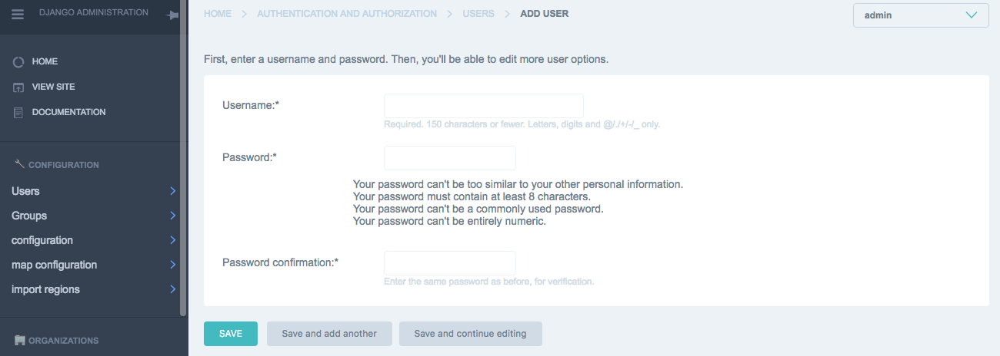
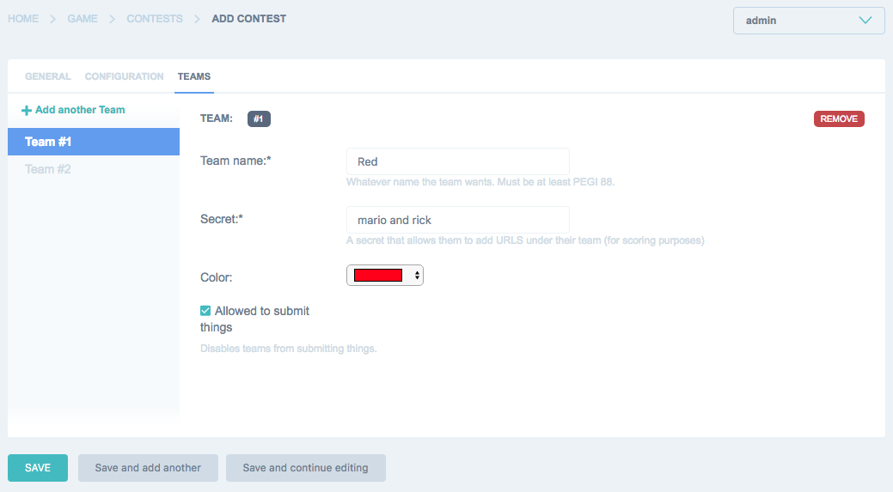
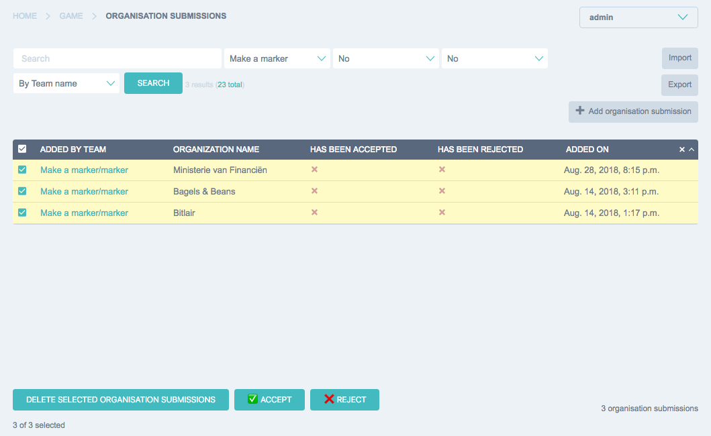

# Running a monitoring game
These instructions help you setting up a "monitor your government" game.

The rules are simple: add organizations and urls, get points for each and have the high score.

This has been tested with groups of up to 50 people and it works great. It's fun!

Todo: screenshot.

## Game overview
Games are on the website under the /game/ url. You can only visit this page when authorized as a valid user. This is to
slightly protect the infrastructure. Authentication is on: /authentication/login/ - Here you log in with a
username and password which we'll create.

The scores page is always public on /game/scores/

For example:
- http://localhost:8000/game/ -- Base location of the game
- http://localhost:8000/authentication/login/ -- Login page for the game
- http://localhost:8000/game/scores/ -- Scoreboard, always public

## Game Administration
Setting up a game requires some manual steps. Some of these will be automated in a future release: you might find some
extra buttons or features as this documentation ages. Don't hesitate to use these features as it might save you time.

### Create a user for your game
First we need to create a user to join a game. This user is created in the admin interface on /admin/. Adding new users
is done at /admin/auth/user/add/. For example: http://localhost:8000/admin/auth/user/add/

The user does not need any further configuration. It does not need permissions or anything else: a username and password
is enough.

Advice: create a new user per game, and share the same user amongst all participants. This saves a lot of time. You can
delete or disable the user afterwards.

### Creating a new game and several teams
Participants can join a team. Each team usually automatically forms from people who sit at the same table. Teams can be
any number of size, but usually the larger teams take the cake as they can do more research.

To create a new game, including a set of teams, you have to use the admin interface.

Contests are located at /admin/game/contest/. For example: http://localhost:8000/admin/game/contest/. In the menu they
are somewhere at the bottom.

With "Add contest" (top, right) you can create a new contest and also add a few teams while you're at it. The following
data needs to be entered:

General tab:

- Name: Any name as you see fit.
- From: The date from which entries can be made.
- To: The date until entries can be submitted.

Configuration tab:

- Target country: the country for which the contest takes place. This filters all search results on this country.
- Logo filename: - can be ignored.

Teams tab:

You can add many teams in one go. Starting a contest it's wise to add about eight teams. (Something will be made to
instantly create ten teams). Teams can also have a color, to distinguish entries during the game. So if you have a lack
of imagination, you can have teams like red, blue, yellow, green, purple, orange, pink, black, white, etc etc etc.

Each team has the following field:

- A name, for example red, green, yolo, etc
- A secret, anyone knowing this secret can join the team. As it takes 1 second to test a secret, the secrets can be kept
fairly simple two word combinations. Such as: "einstein mozart" or "smurfs power rangers" and etc.
- A color, used to distinguish entries during a game
- Allowed to submit things: when this is checked, the team is allowed to submit things. To disqualify a team uncheck this.

You can add as many teams as you like. There are no rules on how teams are assembled, how many people are in a team and
where those people are. You can make those things up as you go along.

What works best is to have some small pieces of paper with the team name and password written/printed on it and passing
that to the team. Something will be made to create printable instructions per team.

### Handling submissions

The admin interface is used for one last thing: handling submissions. When teams start to submit urls and organizations,
they can be approved or denied. This is a very intensive task and in a very busy contest you're likely to accept any
submission except the most obvious fakes and nonsense. In many ways you can have faith in that the participants do try
their best to add usefull stuff as the underlying mission is to monitor the government.

Viewing new submissions can be done using the links "new organizations" and "new urls" in the menu. These are filters
on the entire list of submitted organizations and urls. Usually you'll only have to filter your contest and can
bulk-select and bulk-accept submissions.

## Game participation
After logging in on the game url, the contest page

### Scoreboard

### Contests

### Teams

### Submitting organizations

### List of submitted organizations

### Submitting urls

### List of submitted urls
Makes it easy to object to a submission of another team.

