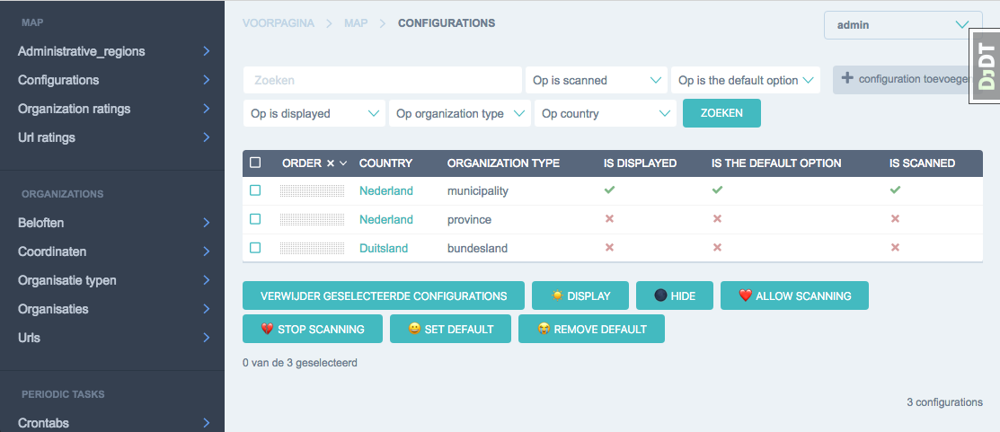

# User Guide
Failmap is split up into two user interfaces and several supporting administrative interfaces.

## The map website
The website is the site intended for humans. There are some controls on the website, such as the
time slider, twitter links and the possibilities to inspect organizations by clicking on them.

Using the map website should be straightforward.

## The admin website
Use the admin website to perform standard [data-operations](https://en.wikipedia.org/wiki/Create,_read,_update_and_delete),
run a series of actions on the data and read documentation of the internal workings of the failmap software.

The admin website is split up in four key parts:
1. Authentication and Authorization
This stores information about who can enter the admin interface and what they can do.

2. Map
Contains all information that is presented to normal humans.
This information is automatically filled based on the scans that have been performed over time.

3. Organizations
Lists of organizations, coordinates and internet adresses.

4. Scanners
Lists of endpoints and assorted scans on these endpoints.

All data in the scanners section of the admin interface is auto-generated. Changing data here makes no sense as it will
be overwritten by a scanner.

## Configuration in the Admin interface

### Common Configurations
... todo ...

### Map / Site Configurations
The map can be configured to show a number of countries and organization types, with a default first view.

All of this is done in the admin interface under:

> Map > Configurations

Below is a sample configuration that can help you getting started. Loading failmap for the first time, this sample
configuration is included as a fixture. You can show any number of countries and organization types.

On the above image, you can see the following features:

1: Ordering

Items can be ordered using drag and drop using the dotted area at the beginning of each row.

Ordering is used to display menu items in a certain order. In the above example the menu will be rendered as:
NL, DE, and the organization types will render as: Municipality, Province for NL, and bundesland for Germany.

In case there is only one country, the country navigation bar will not be shown.
In case there is only one organization_type for a country, the category navigation bar will not be shown.

In the example above no menu will be displayed at all, as there is nothing to navigate to.

2: is_displayed
Determines if a country/organization_type is displayed in the navigation.

3: is_the_default_option
There can be only one default option. If you select multiple, the first one is chosen. The default
is loaded when opening the website for the first time.

4: is_scanned
Todo: Determines if the country/organization_type will be scanned with scanners.

5: buttons

Using the buttons it's possible to easily enable / disable each option without going into details.

Results are effective immediately on development and after cache has expired on public sites.
